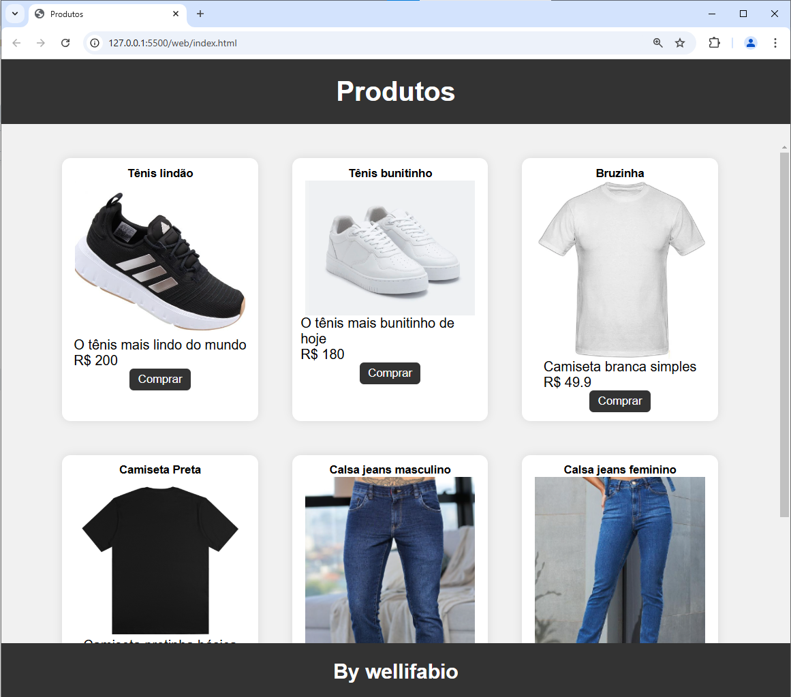

# Listar Cards Produtos
Exemplo de aplicativo web front-end, que lista dados de um vetor JSON e renderiza em forma de **Cards**.

## Requisitos
- [VsCode](https://code.visualstudio.com/)

## Instalação
1. Clone este repositório
2. Abra com o VsCode 
3. Execute o arquivo `index.html` no navegador ou via live server do VsCode.
